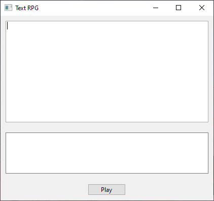
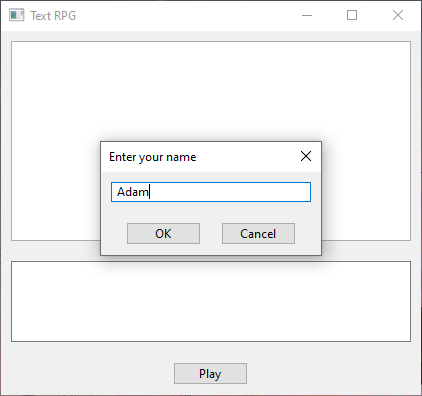
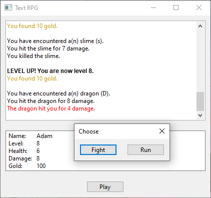

# Text RPG Game
A simple text-based RPG game with a GUI.

  
   
  

## How It's Made:

**Built with:** C++, wxWidgets

Around one month into learning C++, I first built a this RPG game without a GUI from a learncpp.com quiz question. To take things a step further, I 
wanted to experiment with GUIs. I discovered the wxWidgets library and read through the documentation. Thus, in a few days, a built a text-based RPG game, now with a GUI!

## Lessons Learned:

